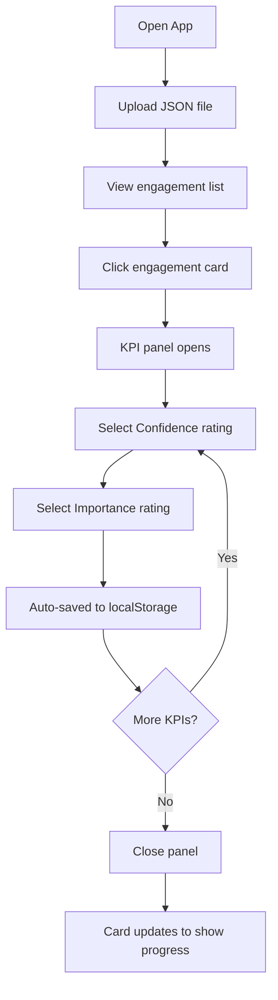
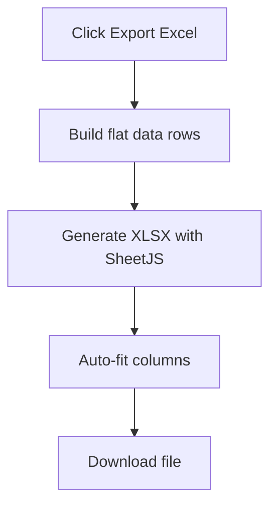

# Product Requirements Document (PRD)
## Tableau de Suivi — Engagements & KPI

**Version:** 1.0
**Date:** December 2025
**Author:** Youssef Chigane

---

## 1. Overview

### 1.1 Product Summary
A single-page web application for tracking contractual commitments (engagements) and their associated Key Performance Indicators (KPIs). Users can load engagement data from JSON files, evaluate each KPI's confidence level and importance, and export their assessments to Excel.

### 1.2 Problem Statement
Organizations managing contractual commitments need a simple, offline-capable tool to:
- Visualize all engagements and their KPIs in one place
- Track completion status of KPI evaluations
- Assign confidence and importance ratings to each KPI
- Export assessment data for reporting

### 1.3 Target Users
- Contract managers
- Compliance officers
- Project managers tracking deliverables
- Quality assurance teams

---

## 2. Features

### 2.1 Core Features

| Feature | Description | Priority |
|---------|-------------|----------|
| JSON Import | Load engagements from `.json` files | P0 |
| Engagement List | Display all engagements in card format | P0 |
| KPI Panel | Side panel showing KPIs for selected engagement | P0 |
| Confidence Rating | Rate each KPI: Oui / Non / Probablement | P0 |
| Importance Rating | Rate each KPI: Haute / Moyenne / Faible | P0 |
| Auto-Save | Persist selections in localStorage | P0 |
| Excel Export | Export selections to `.xlsx` file | P0 |
| Search | Full-text search across all fields | P1 |
| Status Filter | Filter by completion state | P1 |
| Domain Filter | Filter by domain category | P1 |
| KPI Name Filter | Filter by specific KPI name | P1 |

### 2.2 Completion States

| State | Criteria | Visual Indicator |
|-------|----------|------------------|
| Pas initié | No KPIs have ratings | Gray border |
| Partiellement complété | At least 1 KPI rated | Blue border/background |
| Complété | All KPIs rated | Green border/background |

---

## 3. Technical Specifications

### 3.1 Architecture
- **Type:** Single-page application (SPA)
- **Hosting:** Static file hosting (GitHub Pages compatible)
- **Backend:** None (fully client-side)

### 3.2 Technology Stack

| Component | Technology | Version |
|-----------|------------|---------|
| Framework | Vanilla JavaScript | ES6+ |
| Styling | Bootstrap | 5.3.2 |
| Excel Export | SheetJS (xlsx) | 0.18.5 |
| Storage | localStorage | Web API |

### 3.3 Browser Compatibility
- Chrome 90+
- Firefox 88+
- Edge 90+
- Safari 14+

### 3.4 Data Storage
- **Method:** Browser localStorage
- **Key:** `kpi_reference_actions`
- **Format:** JSON object with KPI selections
- **Persistence:** Per browser/device (not synced)

---

## 4. Data Model

### 4.1 Input JSON Schema

```json
[
  {
    "Domaine": "string (optional)",
    "Référence contractuelle": "string",
    "Engagement": "string",
    "Points détaillés de l'engagement": ["string"],
    "Indicateurs & KPI": [
      {
        "ID": "number|string (auto-generated if missing)",
        "Nom_KPI": "string",
        "Définition": "string",
        "Unité": "string",
        "Périodicité": "string",
        "Méthode_de_calcul": "string",
        "Source_donnée": "string"
      }
    ]
  }
]
```

### 4.2 LocalStorage Schema

```json
{
  "kpi": {
    "<kpi_id>": {
      "confidence": "Oui|Non|Probablement|''",
      "importance": "Haute|Moyenne|Faible|''",
      "updatedAt": "ISO 8601 timestamp"
    }
  }
}
```

### 4.3 Excel Export Columns

| Column | Description |
|--------|-------------|
| reference_contractuelle | Contract reference |
| domaine | Domain category |
| engagement | Engagement description |
| kpi_id | Unique KPI identifier |
| kpi_nom | KPI name |
| selection_confiance | User's confidence selection |
| selection_importance | User's importance selection |
| selection_updatedAt | Last update timestamp |

---

## 5. User Interface

### 5.1 Layout Structure

```
┌─────────────────────────────────────────────────────────┐
│ Header: Title + File Upload + Export Button             │
├─────────────────────────────────────────────────────────┤
│ Stats Grid: Engagements | KPI Total | Done | Partial    │
├─────────────────────────────────────────────────────────┤
│ Filters: Search | Domain | KPI | Status                 │
├─────────────────────────────────────────────────────────┤
│                                                         │
│  ┌─────────────────────────────────────────────────┐   │
│  │ Engagement Card (clickable)                      │   │
│  │ - Reference badge with status indicator          │   │
│  │ - Engagement text                                │   │
│  │ - Detail list                                    │   │
│  └─────────────────────────────────────────────────┘   │
│                                                         │
│  ┌─────────────────────────────────────────────────┐   │
│  │ Engagement Card...                               │   │
│  └─────────────────────────────────────────────────┘   │
│                                                         │
└─────────────────────────────────────────────────────────┘

┌──────────────────────────────────┐
│ Offcanvas Panel (80% width)      │
│ ┌──────────┐ ┌──────────┐       │
│ │ KPI Card │ │ KPI Card │       │
│ │ - Name   │ │ - Name   │       │
│ │ - Def    │ │ - Def    │       │
│ │ ○ Conf   │ │ ○ Conf   │       │
│ │ ○ Imp    │ │ ○ Imp    │       │
│ └──────────┘ └──────────┘       │
└──────────────────────────────────┘
```

### 5.2 Responsive Breakpoints

| Breakpoint | Stats Grid | KPI Grid | Offcanvas Width |
|------------|------------|----------|-----------------|
| < 768px | 2 columns | 1 column | 100% |
| 768-992px | 2 columns | 1 column | 80% |
| > 992px | 4 columns | 2 columns | 80% (max 1100px) |

---

## 6. User Flows

### 6.1 Primary Flow: Evaluate KPIs



### 6.2 Export Flow



---

## 7. Non-Functional Requirements

### 7.1 Performance
- Initial load: < 2 seconds
- JSON parsing: < 500ms for 1000 engagements
- Filter/search: < 100ms response time

### 7.2 Accessibility
- Semantic HTML structure
- ARIA labels on interactive elements
- Keyboard navigable forms
- Color contrast meeting WCAG 2.1 AA

### 7.3 Security
- XSS prevention via HTML escaping
- No external data transmission
- All data stays in browser

---

## 8. Limitations & Known Issues

| Limitation | Description |
|------------|-------------|
| No sync | Data is stored per browser/device |
| No backup | Clearing browser data erases selections |
| File size | Large JSON files may slow down initial render |
| Demo button | References non-existent `btnLoadDemo` element |

---

## 9. Future Enhancements (Backlog)

| Enhancement | Description | Effort |
|-------------|-------------|--------|
| Cloud sync | Save selections to cloud storage | Large |
| Multi-user | Collaborative editing | Large |
| PDF export | Export formatted PDF report | Medium |
| Data backup | Export/import localStorage | Small |
| Dark mode | Toggle dark color scheme | Small |
| Bulk actions | Select multiple KPIs at once | Medium |

---

## 10. Deployment

### 10.1 GitHub Pages Setup
1. Repository must contain `index.html` at root
2. Enable GitHub Pages in repository settings
3. Select branch (usually `main`)
4. Site available at `https://<username>.github.io/<repo>/`

### 10.2 Files Required
```
/
├── index.html          # Main application
├── README.md           # Documentation
├── sample-data.json    # Example data file
└── PRD.md             # This document
```

---

## 11. Appendix

### 11.1 Sample JSON Data

```json
[
  {
    "Domaine": "Foncier et autorisations",
    "Référence contractuelle": "4.1",
    "Engagement": "Le Délégant mobilisera le foncier nécessaire...",
    "Points détaillés de l'engagement": [
      "Mobiliser le foncier nécessaire.",
      "Inclure Centres de Maintenance."
    ],
    "Indicateurs & KPI": [
      {
        "Nom_KPI": "Existence foncier Maintenance",
        "Définition": "Indique si terrains mobilisés.",
        "Unité": "oui/non"
      }
    ]
  }
]
```

### 11.2 Glossary

| Term | Definition |
|------|------------|
| Engagement | A contractual commitment or obligation |
| KPI | Key Performance Indicator |
| Confiance | Confidence level in KPI achievement |
| Importance | Priority level of the KPI |
| Délégant | The delegating party (client) |
| Délégataire | The delegate (service provider) |
